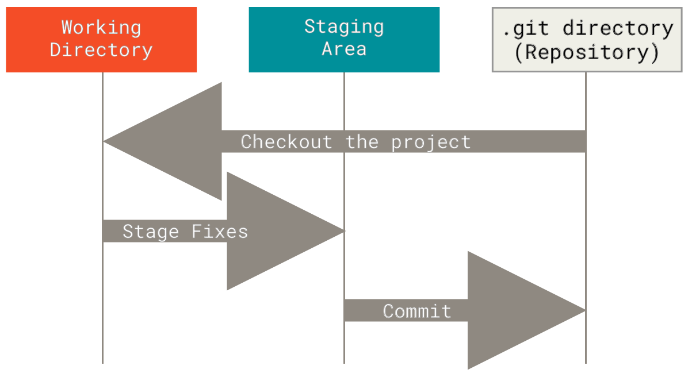

## Welcome to Git and GitHub at ChaiCode Cohort!

This documentation is for you to go through the Git and GitHub commands we use at **ChaiCode Cohort**.

> Following the documentation will help you get familiar with the methodology to follow while committing or handling a ticket. This follows a standardized approach to use so that it’s easier for every developer to have a streamlined workflow to handle Git and GitHub.

---

## Understanding Git

Git is a VCS **Version Control System** which helps in maintaining and tracking files and directories.

### Understanding the 3 States of Files

1. Working Directory
2. Staging Area
3. Git Directory (Repository)

The working directory has all the files that are present.

Those files, once Git is initialized, move towards the staging area, then move towards a commit.

---

> git init

Running `git init` initializes an empty Git repository in the current folder, allowing files and directories to be tracked by Git.

---

### Add a File to Staging Area

_Staging area is the 1st part of the Git process, 2nd is Git commit, and 3rd is Git push._

## Staging Area

> `git add myfile.txt`

This will add `myfile.txt` to the staging area, making it ready for a commit.

> `git add .`

This command adds all the files and directories present in the folder to the staging area.

**_The Git Way_**

Git works on the following cycle where we first write the code and then add the files to the staging area where they will be monitored for the changes and modifications.

Finally, we commit those changes to the desired _branch_ we want to commit to.

The entirety of Git works on this basic principle: **write** => **add** => **commit**

---

> `git status`

This command tells us about the current files that are being tracked and whether there are any modifications made to the currently tracked files.

The files have **M** meaning modified and **A** meaning ready for the commit. Symbols are attached to it.

---

> `git commit -m "first commit"`

This commits an already staged file/s to a commit, which generates a hash value for that commit that marks it as a point to which we can return back to.

This also means that if we make a buggy edit to the program, we can safely revert back to a functionality at which it was working.

---

> `git log`

This logs the commits that we have made.

This shows the date, time, message, and user who made those commits and can be tracked down to the particular state or instance.

This shows the hash value which is used in there.

---

> `git log --oneline`

Gives a single-line commit data only showing the initial hash characters and the message in one line.

> git cat-file _-value_ **hash code**

### Values

- **-t**
  Instead of the content, show the object type identified by the object.

- **-s**
  Instead of the content, show the object size identified by the object.

- **-e**
  Exit with zero status if the object exists and is a valid object.

- **-p**
  Pretty-print the contents of <object> based on its type.

---

> `git branch`

Shows the current branch and all the available branches present.

> `git branch abc`

Creates a new branch named `abc`, which can be used to add alternate features or test new ideas before releasing in the main branch.

---

> `git push`

Pushes the branch to the GitHub repo which was initialized.

---

> `git clone *repo-name*`

Clones a repository into a newly created directory.

> `git pull`

Fetches from and integrates with another repository or a local branch.

---

> `git stash`

Temporarily shelves (or stashes) changes you've made to your working directory.

---

> `git diff`

Shows changes between commits, commit and working tree, etc.

---

> `git merge *branch-name*`

Joins two or more development histories together.

---

> `git rebase *branch-name*`

Reapplies commits on top of another base tip.

---

> `git revert`

Creates a new commit that undoes the changes made by a previous commit.

---

> `git checkout *branch*`

`Checkout` moves to a particular branch you want to go to.

---

### Guidelines for Making a Commit

- The commit should be made in an authoritative tone, like a superior ordering a subordinate.

- The commit’s tone should be in present tense:

      e.g. -> Use the present tense ("Add feature" not "Added feature").

- Capitalize the first letter.

- Use prefixes like `fix: `, `feat: `, `chore: `, `docs:` for categorization.

Examples:

- `feat: Add tea selection feature`
- `fix: Resolve login issue for tea enthusiasts`
- `docs: README with chai varieties`

### Best Practices

- Emphasize the importance of regular commits.

- Encourage the use of descriptive commit messages.

- Explain the importance of pulling updates regularly to avoid conflicts.

